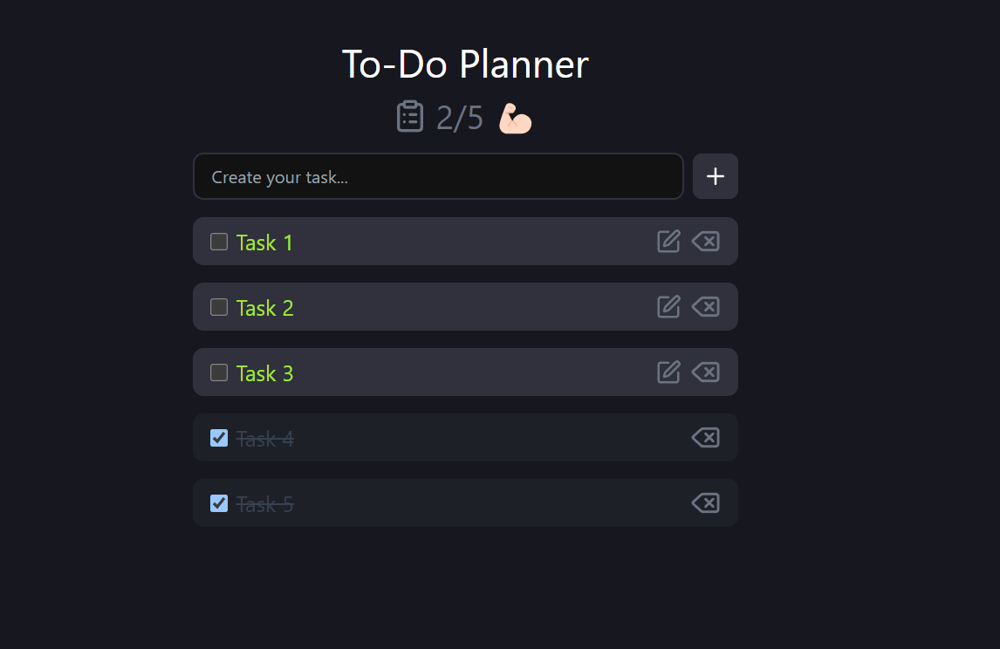

# TO-DO-PLANNER

This is a full-stack To-Do Planner application built using modern web technologies. The project includes both a frontend and a backend, with the following tech stack:

- **Frontend**: Built with [React](https://reactjs.org/), [TypeScript](https://www.typescriptlang.org/), [Vite](https://vitejs.dev/), and styled using [Tailwind CSS](https://tailwindcss.com/).
- **Backend**: Developed with [NestJS](https://nestjs.com/) and [MongoDB](https://www.mongodb.com/) for data storage.

## Technologies Used

<span style="display: inline-flex; gap: 20px;">
  <a href="https://reactjs.org/" target="_blank" rel="noreferrer">
    
  </a>
  <a href="https://nestjs.com/" target="_blank" rel="noreferrer">
    
  </a>
  <a href="https://www.mongodb.com/" target="_blank" rel="noreferrer">
    
  </a>
  <a href="https://www.typescriptlang.org/" target="_blank" rel="noreferrer">
    
  </a>
  <a href="https://tailwindcss.com/" target="_blank" rel="noreferrer">
    
  </a>
</span>




## Site Links

- [View the live site](#)
- [Frontend GitHub Repository](https://github.com/yourusername/to-do-planner)
- [Backend GitHub Repository](https://github.com/Vovababiichuk/NestJS-Backend-To-Do-Planner)
- [Personal Website](https://volodymyrcodepro.site/)

## Author

- **Volodymyr Babiichuk**

## Getting Started

1. **Clone the repository**:
   ```bash
   git clone https://github.com/yourusername/to-do-planner.git
   ```
